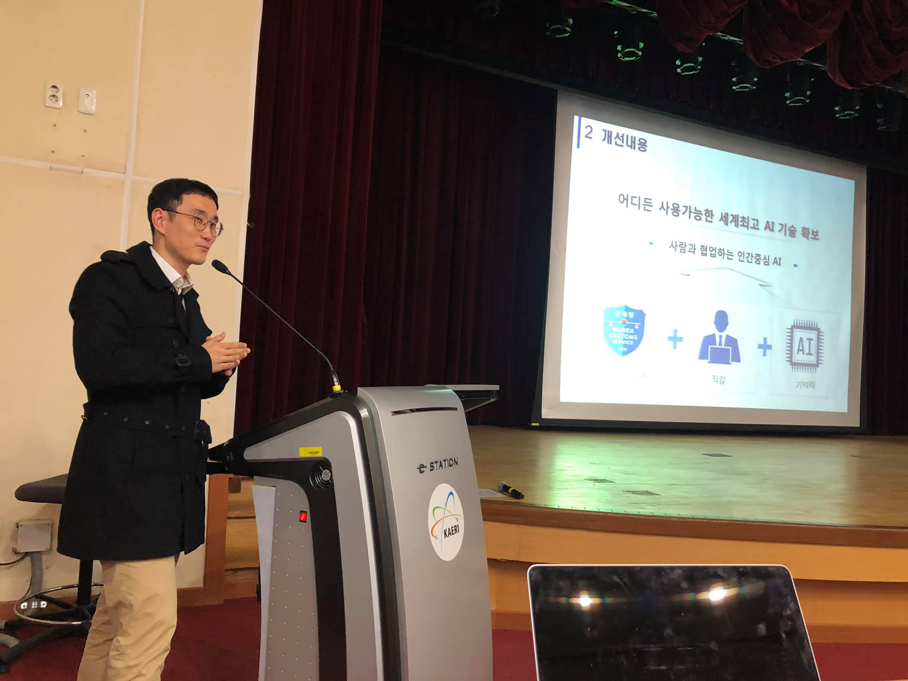

# 세미나 2회

* 일시 : 2018.12.11 오후 3~7
* 장소 : 국제원자력교육훈련센터(INTEC) 대강당
* 프로그램 
- 3:00~ 3:20 AI 프렌즈 활동 보고
- 3:20 ~3:50 한국정보통신기술협회 중소기업 인공지능 지원 사례(TTA 박선례 박사)
- 3:50 ~4:20 인공지능 기반의 우범화물 검색기술 개발 (관세청 문태준 행정관)
- Break
- 4:30 ~5:00 증강현실과 컴퓨터비전을 활용한 VPS(Visual Positioning System) 기술개발 (임퍼펙트 박경규 대표)
- 5:00 ~6:00 KSB 인공지능 프레임워크 소개 및 협력방안 논의 (ETRI 이연희 박사)
- 6:00~ 7:00 네트워킹 (지하식당에서 간단한 저녁식사 준비)

