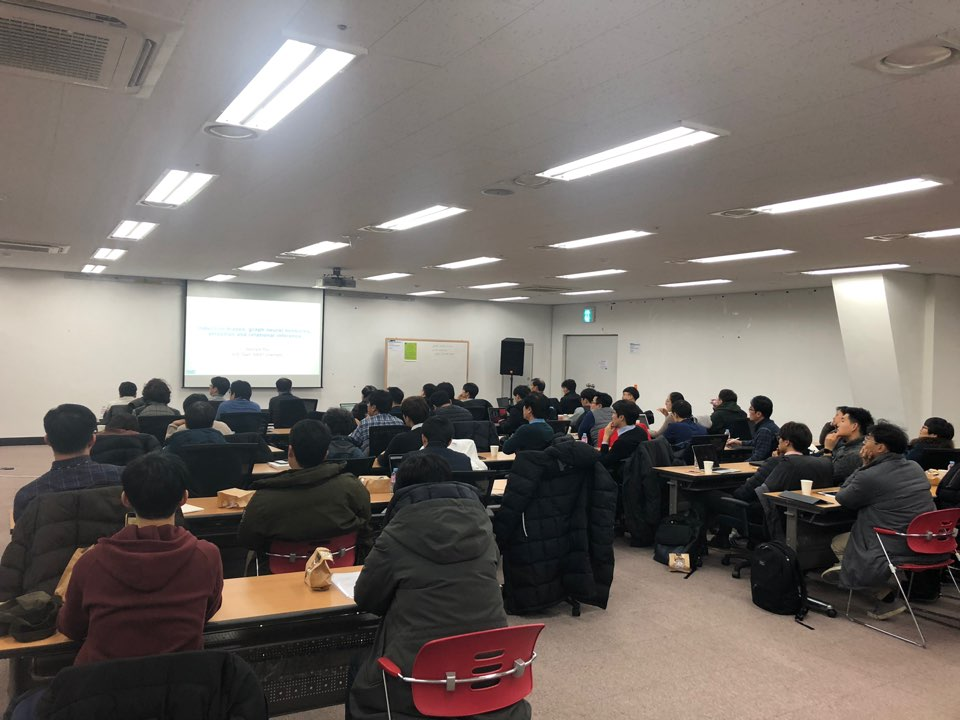

# 스터디 모임 1회 - Graph Neural Network & Bayesian Neural Network

* 일시 : 2018.12.26 (수) 저녁 7~9
* 장소 : ETRI 융합연구센터 2층 224호
* 연사 : 류성옥 (KAIST 화학공학과 박사과정)
* 발표자료 : https://github.com/SeongokRyu/my-study-materials 

