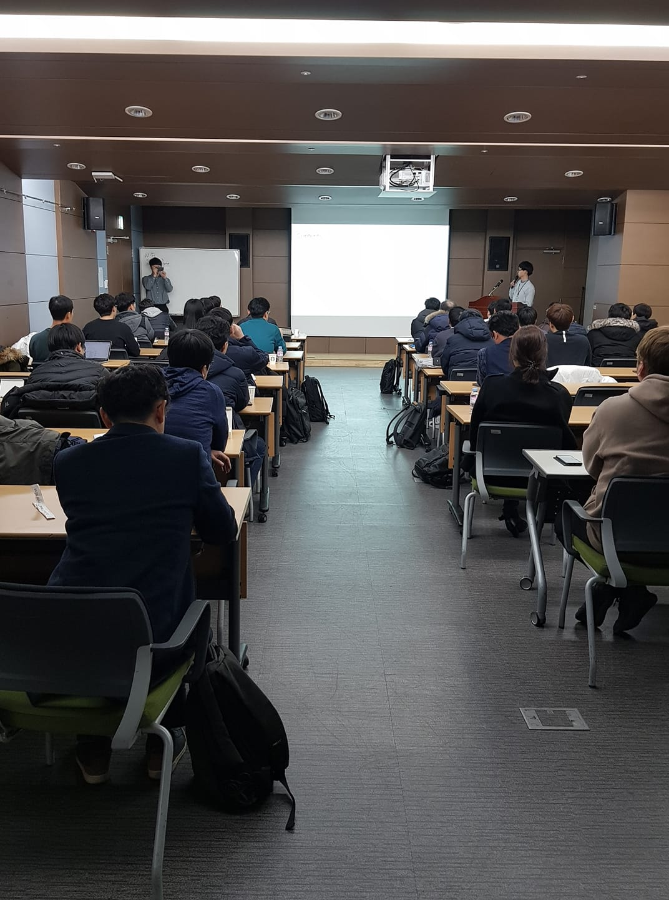

# 스터디 모임 4회

* 일시 : 2019.1.16 (수) 저녁 7~9
* 장소 : TBC 4층 412호
* 연사 : 강민국 (부산대학교 기계공학과), 김홍배 (항공우주연구원)

* Anomaly Detection 최신 기술동향 및 실제 응용 소개 (소개글은 김홍배 박사님 페이스북 글 펌)
  - 부산대 기계공학부에 재학중이면서 SI Analytics 인턴으로 근무중인 강민국군이 다양한 분야에서 응용되고 있는 Anomaly detection 기법에 대해 소개
  - [발표자료](https://github.com/yoyogo96/AI_Friends/blob/master/study190116/%5BAI%20Friends%5DDeep%20Anomaly%20Detection.pdf)

* 기존 Control 이론에 Data driven ML 적용
  - 실제 산업현장에서  모델링이 어려운 plant에 대하여 DL 기법을 적용하여 Model update와 mission을 수행하기 위한 optimal control policy 구하기
  - [발표자료1](https://github.com/yoyogo96/AI_Friends/blob/master/study190116/1_Quadcopter_grey%20model.pdf)
  - [발표자료2](https://github.com/yoyogo96/AI_Friends/blob/master/study190116/2_Real%20time%20optimal%20control%20using%20DNN.pdf)

